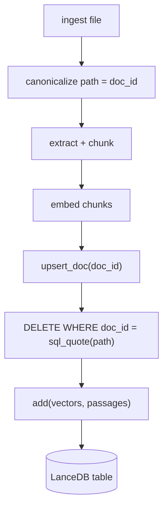
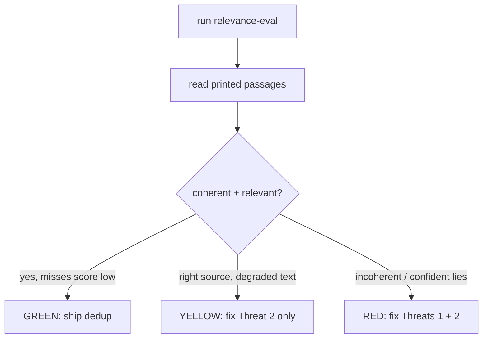
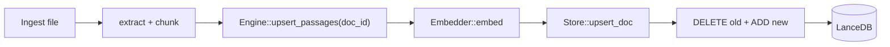

# Plan: Bulk-ingest dedup + relevance eval + conditional chunker hardening

This plan implements three things from `.spar/brief.md`, in strict order:

1. **Per-document dedup/upsert** (serial, correctness) — Phases 1–5
2. **Relevance eval** (Fork B — the quality gate) — Phases 6–7
3. **Conditional chunker hardening** (Fork A — only if the eval verdict warrants) — Phases 8–9
4. **Documentation with mermaid diagrams** — Phase 10

**Global constraints for every phase (the implementer MUST obey these):**

- All `cargo` commands run inside the Nix shell: `nix develop --command cargo <args>`.
- Verification gate after each phase: `cargo fmt`, `cargo clippy -- -D warnings` (zero warnings), `cargo test`, and where coverage matters `cargo tarpaulin` (≥ 90%).
- Imports ordered manually: std → external → crate, merged per-crate (the nightly `imports_granularity` setting is ignored on stable 1.96).
- Error handling uses the Result pattern (`CoreError` / `IngestError`); never `unwrap`/`expect` in non-test code.
- Tests use `FakeEmbedder` + `tempfile::tempdir()`; never hit live Ollama in the default suite.
- The `test-support` feature flag guards test-only utilities (`FakeEmbedder`, `FailingEmbedder`).

---

## Phase 1: Add `doc_id` to the storage schema and `Passage`

Commit message: `feat(core): add doc_id column to passage schema`

### Step 1: Add `doc_id` field to the `Passage` struct

**File:** `crates/core/src/store.rs`

**Context:** The `Passage` struct currently has three fields: `source`, `location`, `text` (lines 31–39).

**Instruction:** Add a `doc_id: String` field as the **first** field of `Passage`. The `doc_id` is the per-document identity key (the absolute file path of the source document), used for dedup/upsert — all chunks extracted from one document share the same `doc_id`.

The resulting struct must look like this:

```rust
/// A text passage stored in the vector database.
///
/// The raw `text` is always stored alongside the vector so that search results
/// carry the original passage without further retrieval. The `doc_id` identifies
/// the source document for dedup/upsert — all chunks from one file share it.
#[derive(Debug, Clone, Serialize, Deserialize)]
pub struct Passage {
    /// Absolute path of the source document (the dedup key).
    pub doc_id: String,
    /// Title or path of the source document.
    pub source: String,
    /// Human-readable location within the source (e.g. "p. 42", "§3.2").
    pub location: String,
    /// The raw passage text that was embedded.
    pub text: String,
}
```

Keep the existing `#[derive(Debug, Clone, Serialize, Deserialize)]`. Do not remove or reorder the existing fields other than placing `doc_id` first.

### Step 2: Add the `doc_id` column to the Arrow schema

**File:** `crates/core/src/store.rs`

**Context:** The `schema(dim: usize)` function (lines 43–56) builds an Arrow schema with columns: `vector`, `source`, `location`, `text`.

**Instruction:** Add a `Field::new("doc_id", DataType::Utf8, false)` as the **first** field in the `fields` vector. The vector must become:

```rust
fn schema(dim: usize) -> Arc<Schema> {
    let vector_field = Field::new("item", DataType::Float32, true);
    let fields = vec![
        Field::new("doc_id", DataType::Utf8, false),             // NEW — must be first
        Field::new(
            "vector",
            DataType::FixedSizeList(Arc::new(vector_field), dim as i32),
            false,
        ),
        Field::new("source", DataType::Utf8, false),
        Field::new("location", DataType::Utf8, false),
        Field::new("text", DataType::Utf8, false),
    ];
    Arc::new(Schema::new(Fields::from(fields)))
}
```

Add a one-line comment `// doc_id must remain first to match RecordBatch column order in add()`.

### Step 3: Build the `doc_id` column in `Store::add`

**File:** `crates/core/src/store.rs`

**Context:** `Store::add` (lines 113–170) currently builds three string columns: `source_builder`, `location_builder`, `text_builder`.

**Instruction:**

1. After the existing string column builders (around line 144), add a `doc_id_builder = StringBuilder::new()`.
2. Before the existing `for p in passages` loop (lines 145–149), create a similar loop that appends `p.doc_id` to `doc_id_builder`. Alternatively, merge it into the existing loop: iterate passages once, appending to all four builders simultaneously.
3. In the `RecordBatch::try_new` call (lines 151–160), insert `Arc::new(doc_id_builder.finish()) as ArrayRef` as the **first** element in the `vec![...]`, before the existing vector column. The column order must be `[doc_id, vector, source, location, text]`.

The resulting `RecordBatch` must look like this:

```rust
let batch = RecordBatch::try_new(
    schema.clone(),
    vec![
        Arc::new(doc_id_builder.finish()) as ArrayRef,    // NEW — first column
        vector_array,
        Arc::new(source_builder.finish()) as ArrayRef,
        Arc::new(location_builder.finish()) as ArrayRef,
        Arc::new(text_builder.finish()) as ArrayRef,
    ],
)
.map_err(|e| CoreError::StoreFailed(e.to_string()))?;
```

Do not change the vector/source/location/text builder logic.

### Phase 1 verification

```bash
nix develop --command cargo fmt
nix develop --command cargo clippy -- -D warnings
# This will fail because existing Passage literals in tests don't have doc_id yet.
# That's expected — we fix call sites in Phase 4.
nix develop --command cargo test -p athenaeum-core
```

---

## Phase 2: Add SQL-quoting helper and `Store::upsert_doc`

Commit message: `feat(core): add upsert_doc with sql-quoted delete predicate`

### Step 1: Add a private `sql_quote` helper

**File:** `crates/core/src/store.rs`

**Context:** The file has no SQL-quoting utility. A private free function is needed.

**Instruction:** Near the top of `store.rs`, after the imports and before the `Passage` struct, add:

```rust
/// Escape single quotes for safe insertion in a LanceDB SQL filter predicate.
///
/// Replaces every `'` with `''` and wraps the result in single quotes, making
/// the string safe for use in a `DELETE WHERE doc_id = …` filter. Required
/// because `doc_id` is a file path and filenames like `O'Reilly - SICP.pdf`
/// will otherwise break the predicate at runtime.
fn sql_quote(value: &str) -> String {
    format!("'{}'", value.replace('\'', "''"))
}
```

Add unit tests in the existing `#[cfg(test)] mod tests` block at the bottom of `store.rs`:

```rust
#[test]
fn test_sql_quote_plain_string() {
    assert_eq!(sql_quote("abc"), "'abc'");
}

#[test]
fn test_sql_quote_with_apostrophe() {
    assert_eq!(sql_quote("O'Reilly"), "'O''Reilly'");
}

#[test]
fn test_sql_quote_multiple_apostrophes() {
    assert_eq!(sql_quote("a'b'c"), "'a''b''c'");
}
```

### Step 2: Add the `Store::upsert_doc` method

**File:** `crates/core/src/store.rs`

**Context:** After the existing `Store::add` method (line 170), before the `Store::search` method (line 172).

**Instruction:** Add a new public async method:

```rust
/// Replace all stored passages for `doc_id` with new ones (delete-then-add upsert).
///
/// Removes any existing rows with matching `doc_id`, then inserts the new
/// `passages` with their `vectors`. All passages MUST carry the same `doc_id`
/// as the first argument. The delete predicate is SQL-quoted so paths
/// containing apostrophes (e.g. `O'Reilly - SICP.pdf`) are safe.
pub async fn upsert_doc(
    &self,
    doc_id: &str,
    vectors: &[Vec<f32>],
    passages: &[Passage],
) -> Result<(), CoreError> {
    let table = self.table().await?;

    // Delete existing rows for this doc_id
    let predicate = format!("doc_id = {}", sql_quote(doc_id));
    table
        .delete(&predicate)
        .await
        .map_err(|e| CoreError::StoreFailed(e.to_string()))?;

    // Insert new rows
    self.add(vectors, passages).await
}
```

**Note to implementer:** LanceDB 0.30's `Table::delete` takes a string predicate. If the actual API is `table.delete(predicate)` returning `Result<()>`, the above is correct. If it differs (e.g. takes a closure or a builder), adapt while preserving the `sql_quote` predicate pattern.

### Phase 2 verification

```bash
nix develop --command cargo fmt
nix develop --command cargo clippy -- -D warnings
# The sql_quote tests should pass even though other tests fail (missing doc_id)
nix develop --command cargo test -p athenaeum-core -- store::test_sql_quote
```

---

## Phase 3: Add `Engine::upsert_passages` and route ingest through it

Commit message: `feat(core): add upsert_passages and remove add_passage`

### Step 1: Add `Engine::upsert_passages`

**File:** `crates/core/src/engine.rs`

**Context:** The `impl<E: Embedder> Engine<E>` block (lines 49–133). `add_passage` (lines 68–81) and `add_passages` (lines 88–110) currently exist but will be removed.

**Instruction:** Add a new public async method **before** the existing `add_passage` (which will be deleted in Step 2):

```rust
/// Batch embed and upsert passages for a single document.
///
/// This is the dedup-aware primary write path. It replaces all prior stored
/// chunks for `doc_id` with the newly embedded `passages`. If `passages` is
/// empty, it still performs the delete (clearing any existing rows for this
/// doc) and returns `Ok(0)`.
///
/// # Errors
/// Returns `CoreError::EmptyInput` if any text field is empty (propagated
/// from the embedder).
pub async fn upsert_passages(
    &self,
    doc_id: &str,
    passages: &[(String, String, String)], // (source, location, text)
) -> Result<usize, CoreError> {
    if passages.is_empty() {
        // Still call upsert_doc with empty data to clear any prior rows.
        self.store.upsert_doc(doc_id, &[], &[]).await?;
        return Ok(0);
    }

    let texts: Vec<String> = passages.iter().map(|(_, _, text)| text.clone()).collect();
    let vectors = self.embedder.embed(&texts).await?;

    let passages_vec: Vec<Passage> = passages
        .iter()
        .map(|(source, location, text)| Passage {
            doc_id: doc_id.to_string(),
            source: source.clone(),
            location: location.clone(),
            text: text.clone(),
        })
        .collect();

    self.store.upsert_doc(doc_id, &vectors, &passages_vec).await?;
    Ok(passages.len())
}
```

### Step 2: Delete `add_passage` and fix `add_passages`, update doc comments

**File:** `crates/core/src/engine.rs`

**Instruction:**

1. Delete the entire `add_passage` method (lines 68–81, from `pub async fn add_passage(` to the closing `}` before `add_passages`).
2. `add_passages` (lines 88–110) constructs `Passage` without `doc_id` — it will no longer compile. Since the canonical path is now `upsert_passages`, delete `add_passages` entirely as well.
3. Update the module-level doc comment (lines 1–9). Remove references to `add_passage`. Replace the `# Write path` section to describe `upsert_passages` as the dedup-aware write path:

```rust
//! # Write path
//!
//! [`Engine::upsert_passages`] is the dedup-aware write path for ingestion.
//! It embeds passages, then performs a document-level upsert (delete old +
//! insert new) keyed on `doc_id`. The [`ingest`] function in the `athenaeum-ingest`
//! crate calls this method per file. Tests may call it directly.
```

### Step 3: Route the ingest pipeline through `upsert_passages`

**File:** `crates/ingest/src/ingest.rs`

**Context:** The `ingest` function (lines 40–101). Currently calls `engine.add_passages(&passages)` at lines 92–95.

**Instruction:**

1. At the top of `ingest()`, after computing `extension` (line 44–48), derive the `doc_id` from the absolute path:

```rust
let doc_id = path
    .canonicalize()
    .map_err(|e| IngestError::IoFailed(e.to_string()))?
    .to_string_lossy()
    .into_owned();
```

2. Replace the `engine.add_passages(&passages)` call (lines 92–95) with:

```rust
engine
    .upsert_passages(&doc_id, &passages)
    .await
    .map_err(IngestError::from)?;
```

3. Add a doc-comment line to the `ingest()` function's doc comment mentioning that `doc_id` is the canonicalized absolute path and that re-ingesting replaces prior chunks.

### Step 4: Update the `engine.rs` unit tests to the new API

**File:** `crates/core/src/engine.rs`

**Context:** The `#[cfg(test)] mod tests` block (lines 137–218).

**Instruction:**

1. **`add_and_search_end_to_end`** (lines 151–183): Replace the two `add_passage(...)` calls:

```rust
engine
    .upsert_passages("book-a.epub", &[
        ("book-a.epub".to_string(), "p. 10".to_string(), "the quick brown fox".to_string()),
    ])
    .await
    .unwrap();
engine
    .upsert_passages("book-b.epub", &[
        ("book-b.epub".to_string(), "p. 20".to_string(), "pack my box with five dozen liquor jugs".to_string()),
    ])
    .await
    .unwrap();
```

Keep all existing assertions.

2. **`batch_add_and_search`** (lines 185–218): Replace the `add_passages(&passages)` call:

```rust
let count = engine.upsert_passages("book-c-doc", &passages).await.unwrap();
assert_eq!(count, 3);
```

Replace `add_passages(&[])`:

```rust
let empty_res = engine.upsert_passages("empty-doc", &[]).await.unwrap();
assert_eq!(empty_res, 0);
```

3. **Add a new test `upsert_replaces_prior_chunks`** to prove dedup:

```rust
#[tokio::test]
async fn upsert_replaces_prior_chunks() {
    let dir = tempfile::tempdir().unwrap();
    let store = Store::open(dir.path(), "passages", 768).await.unwrap();
    let engine = Engine::with_parts(FakeEmbedder { dim: 768 }, store, 768);

    // First upsert: two passages for doc "d1"
    let first = vec![
        ("book-a.epub".to_string(), "p. 1".to_string(), "first chunk".to_string()),
        ("book-a.epub".to_string(), "p. 2".to_string(), "second chunk".to_string()),
    ];
    engine.upsert_passages("d1", &first).await.unwrap();

    // Second upsert: one different passage for same doc "d1"
    let second = vec![
        ("book-a.epub".to_string(), "p. 3".to_string(), "replacement chunk".to_string()),
    ];
    engine.upsert_passages("d1", &second).await.unwrap();

    // Search should only find the replacement chunk (old ones were deleted)
    let hits = engine.search("replacement chunk", 10).await.unwrap();
    assert_eq!(hits.len(), 1, "should have exactly 1 passage after upsert");
    assert_eq!(hits[0].text, "replacement chunk");

    // The old chunks should not appear
    let old_hits = engine.search("first chunk", 10).await.unwrap();
    assert!(old_hits.is_empty(), "old chunks should have been deleted");
}
```

### Phase 3 verification

```bash
nix develop --command cargo fmt
nix develop --command cargo clippy -- -D warnings
nix develop --command cargo test -p athenaeum-core
# The ingest crate will fail to compile because Passage is missing doc_id.
# We fix that in Phase 4.
```

---

## Phase 4: Migrate the MCP server and store tests to the new schema

Commit message: `test(core): migrate passage construction to doc_id schema`

### Step 1: Fix the MCP server seed helper

**File:** `crates/mcp-server/src/main.rs`

**Context:** The `#[cfg(test)]` block (lines 100–145). The `seed` helper (lines 103–117) calls `add_passage` twice.

**Instruction:** Replace both `add_passage(...)` calls with `upsert_passages(...)`:

```rust
async fn seed(server: &AthenaeumServer<FakeEmbedder>) {
    server
        .engine
        .upsert_passages(
            "book-a.epub",
            &[(
                "book-a.epub".to_string(),
                "p. 1".to_string(),
                "the quick brown fox".to_string(),
            )],
        )
        .await
        .unwrap();
    server
        .engine
        .upsert_passages(
            "book-b.epub",
            &[(
                "book-b.epub".to_string(),
                "p. 20".to_string(),
                "pack my box with five dozen liquor jugs".to_string(),
            )],
        )
        .await
        .unwrap();
}
```

Keep the rest of the test (the `SearchHit` deserialization) unchanged.

### Step 2: Fix the `store.rs` unit tests

**File:** `crates/core/src/store.rs`

**Context:** The `#[cfg(test)] mod tests` (lines 246–297). The manual `Passage` literals at lines 273–282 need a `doc_id` field.

**Instruction:** Add `doc_id` as the first field to both `Passage` construction sites:

```rust
let passage_a = Passage {
    doc_id: "book-a.epub".to_string(),
    source: "book-a.epub".to_string(),
    location: "p. 1".to_string(),
    text: "passage a text".to_string(),
};
let passage_b = Passage {
    doc_id: "book-b.epub".to_string(),
    source: "book-b.epub".to_string(),
    location: "p. 2".to_string(),
    text: "passage b text".to_string(),
};
```

Keep all vectors, the `add` call, and assertions unchanged.

### Step 3: Add a `Store::upsert_doc` integration test

**File:** `crates/core/src/store.rs`

**Context:** The `#[cfg(test)] mod tests` block.

**Instruction:** Add two tests:

```rust
#[tokio::test]
async fn upsert_doc_replaces_rows() {
    let dir = tempfile::tempdir().unwrap();
    let store = Store::open(dir.path(), "passages", 8).await.unwrap();

    // Add two passages for docX
    let vec_a = make_vector(0.0, 8);
    let vec_b = make_vector(1.0, 8);
    let passages = vec![
        Passage { doc_id: "docX".into(), source: "a".into(), location: "p.1".into(), text: "original a".into() },
        Passage { doc_id: "docX".into(), source: "b".into(), location: "p.2".into(), text: "original b".into() },
    ];
    store.upsert_doc("docX", &[vec_a, vec_b], &passages).await.unwrap();

    // Upsert again — one replacement passage
    let vec_c = make_vector(2.0, 8);
    let replacement = vec![
        Passage { doc_id: "docX".into(), source: "c".into(), location: "p.3".into(), text: "replacement".into() },
    ];
    store.upsert_doc("docX", &[vec_c], &replacement).await.unwrap();

    // Only one row should remain
    let results = store.search(&make_vector(2.0, 8), 10).await.unwrap();
    assert_eq!(results.len(), 1);
    assert_eq!(results[0].0.text, "replacement");
}

#[tokio::test]
async fn upsert_doc_quotes_apostrophe_path() {
    let dir = tempfile::tempdir().unwrap();
    let store = Store::open(dir.path(), "passages", 8).await.unwrap();

    // Use a doc_id with an apostrophe (non-negotiable #1)
    let apostrophe_doc = "O'Reilly - SICP.pdf";
    let vec_a = make_vector(0.0, 8);
    let passages_a = vec![
        Passage { doc_id: apostrophe_doc.into(), source: "book".into(), location: "p.1".into(), text: "original".into() },
    ];
    store.upsert_doc(apostrophe_doc, &[vec_a], &passages_a).await.unwrap();

    // Upsert again with the same apostrophe doc_id
    let vec_b = make_vector(1.0, 8);
    let passages_b = vec![
        Passage { doc_id: apostrophe_doc.into(), source: "book".into(), location: "p.2".into(), text: "replacement".into() },
    ];
    store.upsert_doc(apostrophe_doc, &[vec_b], &passages_b).await.unwrap();

    // Only the replacement row
    let results = store.search(&make_vector(1.0, 8), 10).await.unwrap();
    assert_eq!(results.len(), 1);
    assert_eq!(results[0].0.text, "replacement");
}
```

### Phase 4 verification

The entire workspace should now compile and pass tests:

```bash
nix develop --command cargo fmt
nix develop --command cargo clippy -- -D warnings
nix develop --command cargo test
# Also verify the ingest and mcp-server crate compile
nix develop --command cargo check -p athenaeum-ingest
nix develop --command cargo check -p athenaeum-mcp-server
```

---

## Phase 5: Add `FailingEmbedder` and prove the "keep going" loop

Commit message: `test(ingest): prove one bad file does not abort the run`

### Step 1: Add a `FailingEmbedder` test utility to core

**File:** `crates/core/src/embed.rs`

**Context:** After the `FakeEmbedder` block (lines 115–140), which is behind `#[cfg(any(test, feature = "test-support"))]`.

**Instruction:** Add a new struct and implementation behind the same cfg gate:

```rust
/// An embedder that fails on a configurable call, for testing error-recovery.
///
/// Behaves exactly like [`FakeEmbedder`] except that the Nth call to `embed()`
/// returns `Err(CoreError::Http("simulated embed failure".to_string()))`.
/// Use this to prove that the ingestion loop records a failure and continues
/// rather than aborting (non-negotiable #2).
#[cfg(any(test, feature = "test-support"))]
pub struct FailingEmbedder {
    pub dim: usize,
    pub fail_on_call: usize,
    pub counter: std::sync::Arc<std::sync::atomic::AtomicUsize>,
}

#[cfg(any(test, feature = "test-support"))]
impl FailingEmbedder {
    /// Create a new `FailingEmbedder` that fails on the `fail_on_call`-th
    /// `embed()` call (1-indexed).
    pub fn new(dim: usize, fail_on_call: usize) -> Self {
        Self {
            dim,
            fail_on_call,
            counter: std::sync::Arc::new(std::sync::atomic::AtomicUsize::new(0)),
        }
    }
}

#[cfg(any(test, feature = "test-support"))]
#[async_trait]
impl Embedder for FailingEmbedder {
    async fn embed(&self, inputs: &[String]) -> Result<Vec<Vec<f32>>, CoreError> {
        if inputs.is_empty() || inputs.iter().any(|s| s.is_empty()) {
            return Err(CoreError::EmptyInput);
        }

        let call_count = self.counter.fetch_add(1, std::sync::atomic::Ordering::Relaxed) + 1;
        if call_count == self.fail_on_call {
            return Err(CoreError::Http("simulated embed failure".to_string()));
        }

        // Same deterministic logic as FakeEmbedder
        let vecs = inputs
            .iter()
            .map(|s| {
                let sum: u64 = s.bytes().map(u64::from).sum();
                (0..self.dim)
                    .map(|i| ((sum + i as u64) % 256) as f32 / 255.0)
                    .collect()
            })
            .collect();

        Ok(vecs)
    }
}
```

Add a unit test in the existing `#[cfg(test)]` block (after the `FakeEmbedder` tests, lines 144–202):

```rust
#[cfg(any(test, feature = "test-support"))]
mod failing_embedder_tests {
    use super::*;

    #[tokio::test]
    async fn failing_embedder_fails_on_nth_call() {
        let embedder = FailingEmbedder::new(4, 2);

        // First call succeeds
        let result = embedder.embed(&["hello".to_string()]).await;
        assert!(result.is_ok());

        // Second call fails
        let result = embedder.embed(&["world".to_string()]).await;
        assert!(matches!(result, Err(CoreError::Http(_))));

        // Third call succeeds again
        let result = embedder.embed(&["third".to_string()]).await;
        assert!(result.is_ok());
    }
}
```

### Step 2: Add a "keep going" integration test in the ingest crate

**File:** Create a new file `crates/ingest/tests/keep_going.rs`.

**Instruction:** Write an integration test proving embed errors surface as `Err` without aborting:

```rust
//! Test that `upsert_passages` handles embed errors gracefully.
//!
//! Non-negotiable #2: one bad file must not abort the run. This test asserts
//! that an embed failure returns an `Err` (which the CLI loop converts to a
//! `failed_files` entry) rather than panicking or deadlocking. Only the
//! FailingEmbedder can provide this test — live-Ollama tests cannot simulate
//! the failure mode.

use athenaeum_core::embed::Embedder;
use athenaeum_core::{CoreError, Engine, Store};

#[tokio::test]
#[cfg(any(test, feature = "test-support"))]
async fn embed_failure_returns_error_does_not_abort() {
    use athenaeum_core::embed::FailingEmbedder;

    let dir = tempfile::tempdir().unwrap();
    let store = Store::open(dir.path(), "passages", 768).await.unwrap();
    let embedder = FailingEmbedder::new(768, 1); // fails on first call
    let engine = Engine::with_parts(embedder, store, 768);

    let result = engine
        .upsert_passages(
            "will-fail",
            &[(
                "test.epub".to_string(),
                "p. 1".to_string(),
                "this will fail to embed".to_string(),
            )],
        )
        .await;

    assert!(
        result.is_err(),
        "upsert_passages should propagate the embed error"
    );
    match result {
        Err(CoreError::EmbeddingFailed(_)) | Err(CoreError::Http(_)) => { /* expected */ }
        _ => panic!("unexpected error variant"),
    }
}

#[tokio::test]
#[cfg(any(test, feature = "test-support"))]
async fn non_failing_embed_still_succeeds() {
    use athenaeum_core::embed::FakeEmbedder;

    let dir = tempfile::tempdir().unwrap();
    let store = Store::open(dir.path(), "passages", 768).await.unwrap();
    let embedder = FakeEmbedder { dim: 768 };
    let engine = Engine::with_parts(embedder, store, 768);

    let result = engine
        .upsert_passages(
            "will-succeed",
            &[(
                "test.epub".to_string(),
                "p. 1".to_string(),
                "this will embed fine".to_string(),
            )],
        )
        .await;

    assert!(result.is_ok(), "normal embedder should succeed: {:?}", result.err());
    assert_eq!(result.unwrap(), 1);
}
```

### Step 3: Enable `test-support` for the ingest crate's dev dependencies

**File:** `crates/ingest/Cargo.toml`

**Context:** The `[dev-dependencies]` section (currently just `tokio`).

**Instruction:** Add:

```toml
[dev-dependencies]
athenaeum-core = { path = "../core", features = ["test-support"] }
```

This mirrors what `crates/mcp-server/Cargo.toml` does (line 24). Do not change the non-dev `[dependencies]` entry.

### Phase 5 verification

```bash
nix develop --command cargo fmt
nix develop --command cargo clippy -- -D warnings
nix develop --command cargo test
nix develop --command cargo tarpaulin  # ≥ 90%
```

---

## Phase 6: Scaffold the relevance-eval binary (Fork B)

Commit message: `feat(ingest): add relevance-eval binary scaffold`

### Step 1: Add the committed query list

**File:** Create `crates/ingest/eval/queries.toml`.

**Instruction:** Write the following content. The `text` fields are placeholders — the human operator replaces them with real queries **written before re-reading the corpus**. The 5–6 year reading gap is the anti-teaching-to-the-test defense.

```toml
# Relevance evaluation queries for athenaeum-mcp.
#
# INSTRUCTIONS FOR THE HUMAN GRADER:
# 1. Write queries BEFORE re-reading the corpus. The 5–6 year gap since last
#    reading is the only defense against "teaching to the test." Re-reading to
#    write queries would undo this defense.
# 2. "hit" queries expect a relevant passage in top-k (k defaults to 5).
# 3. "miss" queries deliberately ask something NOT in either book. They test
#    whether the system confidently lies (a high-score irrelevant hit) or
#    correctly returns only low-score / no hits. A confident lie on a "miss"
#    query is a demo-killer.
# 4. Replace the placeholder "text" and "note" values with your real queries.
# 5. After running eval, record the verdict (Green/Yellow/Red) in the run notes.

[[query]]
text = "TODO: write a cold-domain question expecting a HIT"
expect = "hit"
note = "Replace this. What would a colleague ask about this domain, phrased in everyday vocabulary, NOT the book's chapter titles?"

[[query]]
text = "TODO: write a second HIT query"
expect = "hit"
note = "Write this before re-reading any of the corpus books."

[[query]]
text = "TODO: write a third HIT query"
expect = "hit"
note = "These should be in your own words from memory of the domain, not the text."

[[query]]
text = "TODO: write a fourth HIT query"
expect = "hit"
note = "Try to phrase it differently than how you think the book phrases it."

[[query]]
text = "TODO: write a fifth HIT query"
expect = "hit"
note = "A query about a specific concept you recall existing in the corpus."

[[query]]
text = "TODO: write a sixth HIT query"
expect = "hit"
note = "Another real question a knowledgeable practitioner might ask."

[[query]]
text = "TODO: write a seventh HIT query"
expect = "hit"
note = "Vary the vocabulary — use synonyms the book likely doesn't use."

[[query]]
text = "TODO: write an eighth HIT query"
expect = "hit"
note = "A query that might have an answer spanning multiple chapters or sections."

[[query]]
text = "TODO: write a MISS query — something NOT in either book"
expect = "miss"
note = "This deliberately tests whether search confidently lies on an unanswerable question. Choose something you're CERTAIN is outside both books' scope. If a hit scores >0.7 on this, that's the demo-killer."

[[query]]
text = "TODO: write a second MISS query"
expect = "miss"
note = "Another out-of-scope question. Both miss queries should have no relevant results at all, or very low scores."
```

### Step 2: Add the eval binary entry

**File:** Create `crates/ingest/src/bin/relevance-eval.rs`.

**Instruction:** Write the scaffold:

```rust
//! Relevance eval — hand-run search-quality instrument.
//!
//! Ingests a corpus directory, runs a set of queries from a TOML file, and
//! prints full passages for human judgment. This is NOT a pass/fail test —
//! it is a diagnostic that produces evidence for a human verdict.
//!
//! # Usage
//!
//! ```text
//! nix develop --command cargo run -p athenaeum-ingest --bin relevance-eval -- \
//!     --corpus /path/to/corpus
//! ```
//!
//! # Preconditions
//!
//! - Live Ollama running with `nomic-embed-text` loaded.
//! - Run from the repo root (default store is `./data/athenaeum`).
//! - The `--corpus` directory must contain `.pdf` and/or `.epub` files.
//!
//! # Output
//!
//! For each query, prints: the query text, its `expect` tag, the `note`,
//! and then the top-k hits each with `score`, `source`, `location`, and
//! the **full** passage `text`. The operator reads the output and records
//! a Green/Yellow/Red verdict (see `docs/relevance-eval.md`).
//!
//! # CI
//!
//! This binary MUST NOT be added to CI or the default `cargo test` suite.
//! It requires live Ollama and a human grader.

use anyhow::{Context, Result};
use athenaeum_core::{Config, Engine};
use clap::Parser;
use std::path::PathBuf;

#[derive(Parser, Debug)]
#[command(name = "relevance-eval")]
#[command(about = "Evaluate search quality on a given corpus with a list of queries")]
struct Args {
    /// Directory containing PDF/EPUB files to ingest for the eval.
    #[arg(long, value_name = "DIR")]
    corpus: PathBuf,

    /// Path to the queries TOML file.
    #[arg(long, default_value = "crates/ingest/eval/queries.toml")]
    queries: PathBuf,

    /// Number of top results to return per query.
    #[arg(long, default_value_t = 5)]
    k: usize,
}

struct EvalQuery {
    text: String,
    expect: String, // "hit" or "miss"
    note: String,
}

#[tokio::main]
async fn main() -> Result<()> {
    let args = Args::parse();

    if !args.corpus.is_dir() {
        anyhow::bail!("Corpus directory does not exist: {}", args.corpus.display());
    }

    // Load queries
    let query_content = std::fs::read_to_string(&args.queries)
        .with_context(|| format!("Failed to read queries file: {}", args.queries.display()))?;
    let parsed: toml::Value = toml::from_str(&query_content)
        .context("Failed to parse queries TOML file")?;

    let queries: Vec<EvalQuery> = parsed
        .get("query")
        .and_then(|v| v.as_array())
        .map(|arr| {
            arr.iter()
                .map(|item| EvalQuery {
                    text: item
                        .get("text")
                        .and_then(|v| v.as_str())
                        .unwrap_or("MISSING")
                        .to_string(),
                    expect: item
                        .get("expect")
                        .and_then(|v| v.as_str())
                        .unwrap_or("hit")
                        .to_string(),
                    note: item
                        .get("note")
                        .and_then(|v| v.as_str())
                        .unwrap_or("")
                        .to_string(),
                })
                .collect()
        })
        .unwrap_or_default();

    println!("Loaded {} query/queries from {}", queries.len(), args.queries.display());
    println!("Corpus directory: {}", args.corpus.display());
    println!("Top-k: {}", args.k);
    println!("The full eval loop will be implemented in Phase 7.\n");

    for (i, q) in queries.iter().enumerate() {
        println!("  [{}/{}] expect={}: {}", i + 1, queries.len(), q.expect, q.text);
    }

    Ok(())
}
```

Add `toml` to `crates/ingest/Cargo.toml` if not already present:

```toml
# In [dependencies]
toml = "0.8"
```

### Phase 6 verification

```bash
nix develop --command cargo fmt
nix develop --command cargo clippy -- -D warnings
nix develop --command cargo check -p athenaeum-ingest  # compiles the new binary
nix develop --command cargo run -p athenaeum-ingest --bin relevance-eval -- --corpus . 2>&1 || true
# Should print usage or the "not implemented" message, not panic
```

---

## Phase 7: Implement the eval run loop and human-readable output (Fork B)

Commit message: `feat(ingest): implement relevance-eval ingest-search-print loop`

### Step 1: Wire ingestion into the eval binary

**File:** `crates/ingest/src/bin/relevance-eval.rs`

**Instruction:** After arg/query parsing and before printing "The full eval loop will be implemented...", add the ingest phase:

```rust
// ── Initialize engine ──────────────────────────────────────────────────
let config = Config::default();
let engine = Engine::new(config).await.context("Failed to initialize engine")?;

// ── Collect files ──────────────────────────────────────────────────────
let files = collect_files(&args.corpus, true) // recursive = true
    .context("Failed to collect corpus files")?;

println!("Ingesting {} file(s) from {} ...\n", files.len(), args.corpus.display());

let mut ingest_ok = 0usize;
let mut ingest_fail = 0usize;

for (idx, file_path) in files.iter().enumerate() {
    let file_name = file_path
        .file_name()
        .and_then(|n| n.to_str())
        .unwrap_or("unknown");

    print!("  [{}/{}] {} ... ", idx + 1, files.len(), file_name);
    std::io::Write::flush(&mut std::io::stdout()).ok();

    match athenaeum_ingest::ingest(&engine, file_path).await {
        Ok(summary) => {
            println!("✓ ({} chunks)", summary.chunks);
            ingest_ok += 1;
        }
        Err(e) => {
            println!("✗ ERROR: {}", e);
            ingest_fail += 1;
        }
    }
}

println!(
    "\nIngest done: {} ok, {} failed\n",
    ingest_ok, ingest_fail
);
println!("{}", "=".repeat(72));
```

Also include the `collect_files` helper (copied from `athenaeum-ingest.rs:107-135`) or, if you prefer, factor it into the ingest lib and import it. For simplicity, copy it with a comment:

```rust
/// Collect all PDF and EPUB files from the given directory (recursive).
fn collect_files(dir: &PathBuf, recursive: bool) -> Result<Vec<PathBuf>> {
    let mut files = Vec::new();
    let entries = std::fs::read_dir(dir).context("Failed to read directory")?;
    for entry in entries {
        let entry = entry.context("Failed to read directory entry")?;
        let path = entry.path();
        if path.is_file() {
            if let Some(ext) = path.extension() {
                if let Some(ext_str) = ext.to_str() {
                    let ext_lower = ext_str.to_lowercase();
                    if ext_lower == "pdf" || ext_lower == "epub" {
                        files.push(path);
                    }
                }
            }
        } else if path.is_dir() && recursive {
            let mut sub = collect_files(&path, recursive)?;
            files.append(&mut sub);
        }
    }
    files.sort();
    Ok(files)
}
```

### Step 2: Run queries and print full passages for judgment

**File:** `crates/ingest/src/bin/relevance-eval.rs`

**Instruction:** After the ingest phase (after the separator line and before `Ok(())`), add the query phase:

```rust
println!("\nSearch Results\n");

for (query_idx, q) in queries.iter().enumerate() {
    println!("═══ Query {}/{} ════════════════════════════════════════════════", query_idx + 1, queries.len());
    println!("  Query: {}", q.text);
    println!("  Expect: {}", q.expect);
    println!("  Note:   {}", q.note);
    println!();

    match engine.search(&q.text, args.k).await {
        Ok(hits) => {
            if hits.is_empty() {
                println!("  (no results returned)");
            } else {
                for (hit_idx, hit) in hits.iter().enumerate() {
                    println!("  ── Hit {}/{} ────────────────────────────────────────", hit_idx + 1, hits.len());
                    println!("  Score:    {:.4}", hit.score);
                    println!("  Source:   {}", hit.source);
                    println!("  Location: {}", hit.location);
                    println!("  Text:");
                    // Indent each line of the passage text for readability
                    for line in hit.text.lines() {
                        println!("    {}", line);
                    }
                    println!();
                }
            }
        }
        Err(e) => {
            println!("  ⚠ SEARCH FAILED: {}", e);
        }
    }

    // Grading reminder
    println!("  ── Grade ──────────────────────────────────────────────");
    println!("  1. Relevant passage present in top-{}? yes / no", args.k);
    println!("  2. Passage coherent (not mid-sentence / not truncated)? yes / no");
    if q.expect == "miss" {
        println!("  3. (MISS) All scores low (< 0.5)? yes / no");
        println!("  3b. (MISS) Any hit that looks confidently relevant? no / yes → DEMO-KILLER");
    }
    println!();
}
```

Replace the old placeholder print at the end with the Grading Summary footer:

```rust
println!("{}", "=".repeat(72));
println!("\n All queries complete. Grade each query above, then record the overall verdict:\n");
println!("  GREEN  = coherent, relevant, misses low-score  → ship dedup, skip Fork A");
println!("  YELLOW = right sources but degraded text        → fix Threat 2 only");
println!("  RED    = incoherent / confident lies on misses  → fix Threats 1+2 before demo");
println!("\nRecord the verdict and any findings in your eval notes.");
```

### Step 3: Expand the module doc comment with usage

**File:** `crates/ingest/src/bin/relevance-eval.rs`

**Instruction:** Replace the placeholder doc comment at the top with the full usage explanation (already shown in the Phase 6 scaffold — verify it includes the full usage block, the preconditions, and the CI disclaimer). Ensure it references `docs/relevance-eval.md` for the verdict definitions.

### Phase 7 verification

```bash
# Verify it compiles
nix develop --command cargo fmt
nix develop --command cargo clippy -- -D warnings
nix develop --command cargo check -p athenaeum-ingest

# Full end-to-end test against live Ollama (manual, hand-run)
# nix develop --command cargo run -p athenaeum-ingest --bin relevance-eval -- \
#     --corpus /path/to/your/real/corpus \
#     --queries crates/ingest/eval/queries.toml
```

**Important:** Do NOT run the full eval in CI. The binary must be hand-run only.

---

## Phase 8: [CONDITIONAL — only if Fork B verdict is Yellow or Red] Fix Threat 2 (token truncation)

> **Gate:** Implement this phase **only if** the Phase 7 eval verdict shows truncated/abrupt passages (Yellow or Red). If the verdict is Green, skip Phases 8–9 entirely and proceed to Phase 10.

### Step 1: Replace the token estimate with a conservative margin

**File:** `crates/ingest/src/chunking.rs`

**Context:** `estimate_tokens` function (lines 141–144) uses `words × 1.3`.

**Instruction:** Change the estimator to use a conservative multiplier:

```rust
/// Estimate token count using whitespace word count (1 word ≈ 2.0 tokens).
///
/// Uses a deliberately conservative ratio (2.0×) to avoid silent truncation of
/// dense technical text (identifiers, numbers, symbols, non-English terms).
/// Ollama's BPE tokenizer can encode such text at 1.5–2.0× the word count,
/// so the standard 1.3× heuristic is insufficient for technical prose.
fn estimate_tokens(text: &str) -> usize {
    let word_count = text.split_whitespace().count();
    ((word_count as f64) * 2.0).ceil() as usize
}
```

Update the doc comment of `chunk_text` (line 35) from `1 word ≈ 1.3 tokens` to `1 word ≈ 2.0 tokens (conservative estimate)`.

Update the `test_estimate_tokens` unit test (lines 177–183):

```rust
#[test]
fn test_estimate_tokens() {
    let text = "This is a test";
    let tokens = estimate_tokens(text);
    // 4 words * 2.0 = 8.0, ceil = 8
    assert_eq!(tokens, 8);
}
```

### Step 2: Add a guard test for oversized chunks

**File:** `crates/ingest/src/chunking.rs`

**Context:** The `#[cfg(test)] mod tests` block.

**Instruction:** Add:

```rust
#[test]
fn test_no_chunk_exceeds_max() {
    // Generate a long repetitive text
    let sentence = "This is a test sentence with enough words to fill a chunk. ";
    let long_text = sentence.repeat(200);
    let config = ChunkingConfig {
        min_tokens: 100,
        max_tokens: 500,
        overlap_tokens: 50,
    };

    let chunks = chunk_text(&long_text, config.clone());

    // Every chunk must have reasonable size
    assert!(!chunks.is_empty());
    for chunk in &chunks {
        assert!(
            chunk.token_count <= config.max_tokens,
            "chunk has {} tokens, max is {}",
            chunk.token_count,
            config.max_tokens
        );
        assert!(chunk.token_count > 0);
    }
}
```

### Phase 8 verification

```bash
nix develop --command cargo fmt
nix develop --command cargo clippy -- -D warnings
nix develop --command cargo test -p athenaeum-ingest
nix develop --command cargo tarpaulin  # ≥ 90%
```

---

## Phase 9: [CONDITIONAL — only if Fork B verdict is Red] Fix Threat 1 (sentence-split shredding)

> **Gate:** Implement this phase **only if** the Phase 7 eval verdict shows incoherent passages from false sentence splits (Red). If Yellow or Green, skip.

### Step 1: Add an abbreviation/decimal guard to `split_into_sentences`

**File:** `crates/ingest/src/chunking.rs`

**Context:** The `split_into_sentences` function (lines 91–138).

**Instruction:** Harden the splitter to suppress false positives. Add a static abbreviation set and a check for inter-digit periods before the "uppercase after space" heuristic:

```rust
/// Known abbreviations that should NOT trigger a sentence boundary,
/// even though they end with a period followed by a space and an
/// uppercase letter. This list is not exhaustive — aim is to prevent
/// the most common false splits that shred technical prose (citations,
/// cross-references, academic abbreviations).
const ABBREVIATIONS: &[&str] = &[
    "fig", "e.g", "i.e", "vs", "al", "cf", "etc",
    "dr", "mr", "mrs", "ms",
    "sec", "eq", "no", "st", "dept",
];

/// Check if a token is a known abbreviation (case-insensitive).
fn is_abbreviation(token: &str) -> bool {
    let lower = token.trim_end_matches('.').to_lowercase();
    ABBREVIATIONS.contains(&lower.as_str())
}

/// Check if a period sits between two digits (decimal or version number).
fn is_decimal_dot(text: &str, pos: usize) -> bool {
    let bytes = text.as_bytes();
    // Must have a digit before and after the period
    pos > 0
        && pos + 1 < bytes.len()
        && bytes[pos] == b'.'
        && bytes[pos - 1].is_ascii_digit()
        && bytes[pos + 1].is_ascii_digit()
}
```

Modify `split_into_sentences` (lines 91–138). The key change is in the sentence-ending detection section (around lines 99–128). Before the `should_end` logic for uppercase-after-space, add guards:

```rust
if ch == '.' || ch == '!' || ch == '?' {
    let mut should_end = false;

    // ── Anti-false-split guards ───────────────────────────────────────
    // Do NOT split if the period is part of an abbreviation
    if ch == '.' {
        // Extract the word before the period
        let before = current_sentence.trim();
        let last_word = before.split_whitespace().last().unwrap_or("");
        if is_abbreviation(last_word) {
            continue; // skip: this is an abbreviation, not a sentence end
        }

        // Do NOT split if the period is between digits (decimal/version)
        let text_bytes = current_sentence.as_bytes();
        let dot_pos = text_bytes.len() - 1; // position of this '.'
        if is_decimal_dot(&current_sentence, dot_pos) {
            continue; // skip: this is a decimal/version number
        }
    }
    // ── ────────────────────────────────────────────────────────────────

    // Existing logic: look ahead for uppercase
    if chars.peek().is_none() {
        should_end = true;
    } else if chars.peek() == Some(&' ') {
        let mut temp_chars = chars.clone();
        temp_chars.next();
        if let Some(&next_ch) = temp_chars.peek() {
            if next_ch.is_uppercase() || next_ch == '\n' {
                should_end = true;
                chars.next();
            }
        }
    }
    // ... (rest of existing logic unchanged)
```

Make sure the existing `split_into_sentences` logic for `!` and `?` is unaffected — the guards above are specific to `.`. The rest of the function (the buffer-clearing logic after line 121, the final remaining-text flush at the end) stays unchanged.

### Step 2: Add false-split regression tests

**File:** `crates/ingest/src/chunking.rs`

**Context:** The `#[cfg(test)] mod tests` block.

**Instruction:** Add:

```rust
#[test]
fn test_no_split_on_abbreviation() {
    let text = "See Fig. 3 for the result. Then continue.";
    let sentences = split_into_sentences(text);
    assert_eq!(sentences.len(), 2, "Should not split on 'Fig.': {:?}", sentences);
    assert_eq!(sentences[0], "See Fig. 3 for the result.");
    assert_eq!(sentences[1], "Then continue.");
}

#[test]
fn test_no_split_on_decimal() {
    let text = "The value is 3.14 in all cases. Done.";
    let sentences = split_into_sentences(text);
    assert_eq!(sentences.len(), 2, "Should not split on '3.14': {:?}", sentences);
    assert_eq!(sentences[0], "The value is 3.14 in all cases.");
    assert_eq!(sentences[1], "Done.");
}

#[test]
fn test_no_split_on_e_g() {
    let text = "Use e.g. Rust for systems programming. It is safe.";
    let sentences = split_into_sentences(text);
    assert_eq!(sentences.len(), 2, "Should not split on 'e.g.': {:?}", sentences);
    assert_eq!(sentences[0], "Use e.g. Rust for systems programming.");
    assert_eq!(sentences[1], "It is safe.");
}

#[test]
fn test_still_splits_genuine_boundaries() {
    let text = "First sentence. Second sentence! Third sentence? Fourth.";
    let sentences = split_into_sentences(text);
    assert_eq!(sentences.len(), 4, "Genuine boundaries must still split: {:?}", sentences);
}
```

### Phase 9 verification

```bash
nix develop --command cargo fmt
nix develop --command cargo clippy -- -D warnings
nix develop --command cargo test -p athenaeum-ingest
nix develop --command cargo tarpaulin  # ≥ 90%
```

---

## Phase 10: Documentation with mermaid diagrams

Commit message: `docs: document dedup upsert path and relevance eval`

### Step 1: Update `docs/ingestion.md` with the dedup/upsert model

**File:** `docs/ingestion.md`

**Context:** The file exists and describes the old append-only ingestion path. The section around line 214 mentions `rm -rf` for dedup.

**Instruction:** Replace the old dedup guidance with the new model. Add after the ingestion overview:

````markdown
## Document dedup via upsert (since v0.2)

Ingestion is now dedup-aware. When you re-ingest a file, its prior chunks are
replaced rather than duplicated. This is a document-level upsert (delete-then-add)
keyed on `doc_id` — the canonicalized absolute file path.



The delete predicate is SQL-quoted (`'` → `''`) so paths containing apostrophes
(e.g. `O'Reilly - SICP.pdf`) are safe. The chunking logic (`chunking.rs`) is
unchanged — upsert replaces the storage layer only.

### Schema change (v0.2)

A `doc_id` column was added to the LanceDB schema (breaking change). If you
have an existing `./data/athenaeum` store from a prior version, delete it
before running the new binary:

```bash
rm -rf ./data/athenaeum
```

Then re-ingest your corpus. This is a one-time migration; subsequent ingests
will use the upsert path and re-ingestion of the same file will replace its
prior chunks rather than duplicate them.
````

Keep the rest of `docs/ingestion.md` intact (setup, extractors, chunking overview, etc.).

### Step 2: Document the relevance eval workflow

**File:** Create `docs/relevance-eval.md`.

**Instruction:** Write the full document:

````markdown
# Relevance eval — Fork B quality gate

This eval measures search quality on the **existing** chunker and storage code
to decide whether chunker hardening (Fork A) is needed before the colleague demo.

## Purpose

The colleague demo is sold on "search responses that matter for their problem."
Search quality is a function of chunk quality (the search path itself is frozen).
This eval surfaces whether the current chunker produces coherent, findable
passages — or whether it shreds technical prose / silently truncates content.

## Preconditions

- **Live Ollama** running with `nomic-embed-text` loaded.
- **Nix shell:** run all commands inside `nix develop`.
- **Repo root:** run from the repository root (the default store is `./data/athenaeum`).
- **Corpus:** a directory with `.pdf` and/or `.epub` files to ingest for the eval.

## How to run

```bash
nix develop --command cargo run -p athenaeum-ingest --bin relevance-eval -- \
    --corpus /path/to/your/corpus \
    --queries crates/ingest/eval/queries.toml
```

Optional flags:
- `--k <N>` — top-k results per query (default: 5).

## Writing queries

Queries live in `crates/ingest/eval/queries.toml`. Each entry has:

| Field    | Description |
|----------|-------------|
| `text`   | The search query string |
| `expect` | `"hit"` (should return relevant passage) or `"miss"` (should return nothing) |
| `note`   | Free-text note about what a relevant hit looks like |

**Critical rules:**
1. Write queries **before** re-reading the corpus. A 5–6 year gap since last
   reading is the only defense against "teaching to the test."
2. `expect="hit"` queries test the mechanism — does semantic search bridge
   the vocabulary gap between your reconstructed questions and the actual text?
3. `expect="miss"` queries test **discrimination** — does the system confidently
   lie on unanswerable questions? A high-score hit on a miss query is a demo-killer.

Include 2–3 miss queries for things you are certain are NOT in the corpus.

## Reading the output

For each query, the eval prints:
- Query text, expect tag, and note
- Top-k hits with score, source, location, and **full passage text**
- A grading checklist per query

You must **read the passage text**, score alone is insufficient — a high-scoring
hit from the right book may still be a mid-sentence fragment (Threat 1) or
truncated (Threat 2).

## Verdict definition



| Verdict | Criteria | Action |
|---------|----------|--------|
| **GREEN** | All hit queries return coherent, relevant passages; miss queries return low-score/no hits | Ship dedup as-is. Defer Fork A. |
| **YELLOW** | Right sources appear but passages degraded (false splits, truncated tails) | Fix Threat 2 only (token estimate safety margin). Threat 1 may be recoverable via overlap. |
| **RED** | Passages are incoherent (shredded citations, severe truncation) or miss queries return confident lies | Fix both Threats 1 and 2 before demo. |

## What this eval validates

This eval validates the **mechanism** on your shared-work-domain corpus, with
queries written by someone in the same domain as the colleague. The mechanism
(semantic search bridging a vocabulary gap) is shared — if it works here, the
remaining risk at demo time is corpus-specific: does the colleague's particular
text trigger chunker corners the eval corpus didn't?

## CI policy

This binary MUST NOT be added to CI or `cargo test`. It requires live Ollama
and a human grader. It is a hand-run diagnostic instrument.
````

### Step 3: Refresh crate-level and README references

**File:** `crates/core/src/lib.rs`

**Instruction:** Update the module doc comment (lines 1–2) from mentioning `add_passage` to mentioning `upsert_passages`:

```rust
//! `athenaeum-core` — Ollama embedding, LanceDB storage, and the
//! `search(query, k)` / `upsert_passages` core used by the MCP server and
//! the ingestion pipeline.
```

**File:** `crates/core/src/engine.rs`

**Instruction:** Ensure the module-level doc comment (lines 1–9) already references `upsert_passages` (as specified in Phase 3 Step 2). Verify.

**File:** `README.md`

**Context:** The repo root README.

**Instruction:** Add an architecture section with the write-path flow:

```markdown
## Architecture (write path)

The ingestion pipeline extracts text from PDF/EPUB files, chunks it at sentence
boundaries, embeds chunks via Ollama, and stores them in LanceDB. The dedup-aware
upsert path replaces prior chunks for a file when it is re-ingested.



See `docs/ingestion.md` for the full ingestion guide and `docs/relevance-eval.md`
for the quality gate workflow.
```

Place this after the existing project description and before the crate table.

### Phase 10 verification

```bash
# No code to verify — just review the docs render correctly
nix develop --command cargo fmt  # doc comments get formatted too
```

---

## Risks & decisions

1. **`Table::delete` API shape (Phase 2).** The plan assumes lancedb 0.30 exposes delete-by-SQL-predicate as `table.delete(predicate)`. If the actual signature differs, the implementer must adapt while preserving the `sql_quote` predicate. This is the one external-API assumption not verified from source.

2. **Phase 5 Step 2 tests the embed-failure-as-`Err` path but not the full multi-file CLI loop.** The CLI loop in `main()` is not factored into a testable function. If the stronger guarantee is wanted, extract the CLI loop into a library function `ingest_directory(...)` that returns `(ok_count, fail_count, failed_files)`. Currently out of scope.

3. **Phases 8–9 are gated on a human verdict.** They are conditional by design. The *operator* (you) decides after reading the Phase 7 output. A batch pipeline cannot evaluate "is search good?" — the plan marks both phases conditional with a clear gate comment at the start of each.

4. **Coverage on the eval binary.** `relevance-eval.rs` hits live Ollama and won't run under `cargo tarpaulin`. The ≥90% coverage target applies to the library code (dedup, `sql_quote`, `upsert_*`, chunker); the eval binary is excluded by nature. Phase 6/7 verification should run `fmt`/`clippy`/`build` but not expect coverage.
