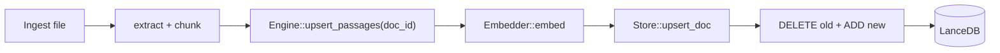

# athenaeum-mcp

A local-first semantic-search MCP server over a personal CS / FP / computer-graphics
library (digital books and research papers). Returns cited, multi-source passages.
Consumed by the brainstorm, spar, and planner agents in opencode as a research
companion during thinking sessions.

## What this is not

- Not a coding assistant backend — coding agents do not access the corpus.
- Not a team tool (yet).
- Not a knowledge graph or relation-extraction system (yet).
- Not proactive or always-on — all retrieval is explicitly triggered.
- Not Obsidian-dependent — books and papers are the corpus.

See [`docs/decision-brief.md`](docs/decision-brief.md) for the full scope,
architecture decisions, and deferred feature roadmap.

## Architecture (write path)

The ingestion pipeline extracts text from PDF/EPUB files, chunks it at sentence
boundaries, embeds chunks via Ollama, and stores them in LanceDB. The dedup-aware
upsert path replaces prior chunks for a file when it is re-ingested.



See `docs/ingestion.md` for the full ingestion guide and `docs/relevance-eval.md`
for the quality gate workflow.

## Workspace layout

| Crate | Name | Role |
|---|---|---|
| `crates/core` | `athenaeum-core` | Ollama embedding + LanceDB storage + `search(query, k)` + `upsert_passages` write path |
| `crates/ingest` | `athenaeum-ingest` | EPUB / PDF parse, chunk, cite |
| `crates/mcp-server` | `athenaeum-mcp-server` | `rmcp` binary — the MCP server spine |
| `crates/parser-spike` | `athenaeum-parser-spike` | Permanent pdfium + epub version canary |

## Prerequisites

- [Nix](https://nixos.org/) with flakes enabled
- [Ollama](https://ollama.com/) running locally with the `nomic-embed-text` model pulled:
  ```bash
  ollama pull nomic-embed-text
  ```

The book corpus lives on your local machine and is **never committed to this
repository** (see `.gitignore`).

## Development

All commands run inside the nix dev shell, which provides the Rust toolchain, pdfium,
and all other system dependencies that Cargo cannot supply.

```bash
# Enter the dev shell
nix develop

# Build
nix develop --command cargo build

# Test
nix develop --command cargo test

# Lint (zero warnings enforced)
nix develop --command cargo clippy -- -D warnings

# Format
nix develop --command cargo fmt

# Coverage (target ≥ 90%)
nix develop --command cargo tarpaulin

# Run the MCP server (exposes search(query, k) over stdio)
# Requires Ollama running with nomic-embed-text; LanceDB data stored under ./data/athenaeum
nix develop --command cargo run -p athenaeum-mcp-server
```

## Configuration

The server has hardcoded compile-time defaults for the single-user local build.
Override any field by constructing `athenaeum_core::Config` directly (used in
tests with a `tempdir` database path).

| Field | Default | Description |
|---|---|---|
| `db_path` | `./data/athenaeum` | LanceDB database directory |
| `table_name` | `passages` | LanceDB table name |
| `ollama_url` | `http://localhost:11434` | Ollama base URL (no trailing slash) |
| `embed_model` | `nomic-embed-text` | Ollama embedding model |
| `embed_dim` | `768` | Embedding vector dimension |

No environment-variable overrides exist in this build step.

## Documentation

Start here for comprehensive guides:

- **[architecture.md](docs/architecture.md)** — System overview with diagrams (container, crate map, data paths, schema).
- **[setup.md](docs/setup.md)** — Installation, first run, troubleshooting, build commands.
- **[ingestion.md](docs/ingestion.md)** — Detailed guide for corpus-scale ingestion; critical operational gotchas.
- **[integration.md](docs/integration.md)** — Wiring the server into opencode agents (brainstorm, spar, planner).

For historical context:

- **[decision-brief.md](docs/decision-brief.md)** — Design decisions, scope, deferred features.
- **[archive/](docs/archive/)** — Implementation records and prior documentation.

## Architecture decision records

- [ADR-0001 — Rust over TypeScript + Bun](docs/adr/0001-language-rust-over-typescript.md)
