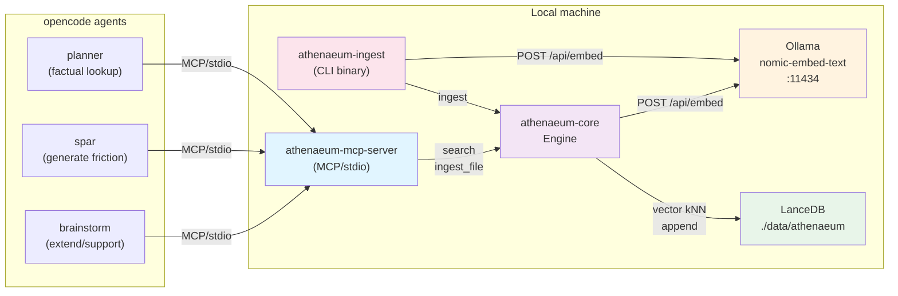

# Architecture — athenaeum-mcp

A local-first semantic-search MCP server over a personal CS / FP / computer-graphics library (digital books and research papers). Returns cited, multi-source passages. Consumed by the brainstorm, spar, and planner agents in opencode as a research companion during thinking sessions — not during coding. Single user, single machine.

---

## System Overview

### Container Diagram

The system has three main entry points:



**Three consumers:**
- **brainstorm agent** — uses corpus to extend and develop ideas; retrieval intent is expand/support.
- **spar agent** — uses corpus to generate friction and counter-arguments; intent is handled in prompt, not backend.
- **planner agent** — uses corpus for factual lookup when questions arise during planning.
- **Coding agents** — do **not** access the corpus (per design decision).

**Two writers:**
- **MCP server** — single-file ingestion via `ingest_file(path)` tool; used by agents during sessions.
- **CLI binary** — bulk directory ingestion via `athenaeum-ingest`; used for corpus-scale loading.

Both write to the same LanceDB store at `./data/athenaeum`.

---

## Crate & Module Map

The workspace has four crates:

```mermaid
flowchart TB
    subgraph core["athenaeum-core<br/>(core search engine)"]
        cfg["config<br/>Config: db_path, table_name,<br/>ollama_url, embed_model, embed_dim"]
        emb["embed<br/>Embedder trait<br/>OllamaEmbedder<br/>FakeEmbedder (test)"]
        sto["store<br/>Store: LanceDB wrapper<br/>Passage: source, location, text"]
        eng["engine<br/>Engine&lt;E: Embedder&gt;<br/>add_passage()<br/>add_passages()<br/>search()"]
        srch["search<br/>SearchHit: source, location,<br/>text, score"]
        err["error<br/>CoreError variants"]
        
        cfg --> eng
        emb --> eng
        sto --> eng
        eng --> srch
        err -.-> eng
    end
    
    subgraph ingest["athenaeum-ingest<br/>(ingestion pipeline)"]
        ext["extract<br/>extract_pdf()<br/>extract_epub()<br/>ExtractedDocument<br/>EpubSection"]
        chk["chunking<br/>chunk_text()<br/>ChunkingConfig<br/>TextChunk"]
        ing["ingest<br/>ingest()<br/>ingest_pdf()<br/>ingest_epub()<br/>IngestSummary"]
        bin["bin/athenaeum-ingest<br/>(CLI: bulk directory)"]
        
        ext --> ing
        chk --> ing
        ing --> bin
    end
    
    mcp["athenaeum-mcp-server<br/>(MCP server spine)<br/>search() tool<br/>ingest_file() tool"]
    
    spike["parser-spike<br/>(version canary)<br/>pdfium + epub"]
    
    ing -->|Engine::add_passages| eng
    bin -->|Engine| ing
    mcp -->|Engine| eng
    mcp -->|ingest()| ing
    
    style core fill:#f3e5f5
    style ingest fill:#fce4ec
    style mcp fill:#e1f5ff
    style spike fill:#fffde7
```

**Public API** (from `crates/core/src/lib.rs`):
- `Config` — runtime configuration (db_path, table_name, ollama_url, embed_model, embed_dim)
- `Embedder` — trait for embedding implementations
- `OllamaEmbedder` — production embedder using Ollama's batch `/api/embed` endpoint
- `Engine<E: Embedder>` — core search interface (add_passage, add_passages, search)
- `SearchHit` — result type (source, location, text, score)
- `Passage` — stored row type (source, location, text)
- `Store` — LanceDB wrapper
- `CoreError` — error type

---

## Search Data Path

When an agent calls `search(query, k)`:

```mermaid
sequenceDiagram
    participant A as Agent<br/>(brainstorm/spar/planner)
    participant S as MCP server
    participant E as Engine
    participant O as Ollama<br/>nomic-embed-text
    participant L as LanceDB
    
    A->>S: search(query, k)
    S->>E: engine.search(query, k)
    E->>O: POST /api/embed<br/>[query]
    O-->>E: embeddings: [[f32; 768]]
    E->>L: nearest_to(vec)<br/>distance_type=Cosine<br/>limit=k
    L-->>E: rows + _distance
    E->>E: score = (1.0 - distance)<br/>.clamp(0.0, 1.0)
    E-->>S: Vec&lt;SearchHit&gt;
    S-->>A: JSON
```

**Key facts:**
- Query is embedded using the same model as the corpus (`nomic-embed-text`, 768-dim).
- LanceDB uses **cosine distance** for similarity.
- Score is normalized: `(1.0 - distance).clamp(0.0, 1.0)` → range [0, 1], where 1 = perfect match.
- Empty table returns `Ok(vec![])`, not an error.
- Raw passage text is always returned alongside the score (no secondary retrieval needed).

---

## Ingest Data Path

When ingesting a document (via CLI or `ingest_file` tool):

```mermaid
sequenceDiagram
    participant C as CLI / ingest_file tool
    participant I as ingest()
    participant X as extract_pdf()<br/>extract_epub()
    participant K as chunk_text()
    participant E as Engine
    participant O as Ollama
    participant L as LanceDB
    
    C->>I: ingest(engine, path)
    I->>X: determine extension<br/>call appropriate extractor
    X-->>I: ExtractedDocument<br/>title, pages/sections
    I->>K: chunk_text(text, config)
    K-->>I: Vec&lt;TextChunk&gt;<br/>500–1000 tokens, 100 overlap
    I->>E: add_passages([(source, location, text)])
    E->>O: POST /api/embed<br/>[all chunk texts]
    O-->>E: embeddings (one call per document)
    E->>L: append RecordBatch
    L-->>E: ok
    E-->>I: Ok(count)
    I-->>C: IngestSummary { documents, chunks }
```

**Key facts:**
- File type determined by extension (`.pdf` or `.epub`).
- **One embedding call per document** — all chunks batched together.
- Chunking uses **sentence-boundary splitting** with configurable overlap.
- Location metadata preserved: PDF uses `page N`, EPUB uses `chapter > section`.
- Append is idempotent at the LanceDB level but **creates duplicates** if re-run (no dedup).

---

## Storage Schema

LanceDB table `passages` (768-dim vectors):

```
┌─────────────────────────────────────────────────────────────┐
│ Column      │ Type                      │ Notes             │
├─────────────────────────────────────────────────────────────┤
│ vector      │ FixedSizeList<Float32,768>│ Embedding vector  │
│ source      │ Utf8                      │ Document title    │
│ location    │ Utf8                      │ page/chapter info │
│ text        │ Utf8                      │ Raw passage text  │
└─────────────────────────────────────────────────────────────┘
```

**Design principle:** Raw text is always stored alongside the vector so that search results carry the original passage without further retrieval. This satisfies the "raw source text" mandate from the decision brief.

---

## Key Invariants & Constraints

1. **Single embedding dimension (768)** — must match the `nomic-embed-text` model. Mismatch is a `CoreError::DimensionMismatch`.
2. **Empty input validation** — both `Embedder::embed()` and `Engine::add_passage()` return `CoreError::EmptyInput` if any text is empty or the slice is empty.
3. **Empty table behavior** — `Store::search()` returns `Ok(vec![])` rather than an error.
4. **Cosine distance** — LanceDB search uses cosine distance; score is `(1 - distance).clamp(0, 1)`.
5. **Relative db_path** — the default `./data/athenaeum` is relative to the working directory. CLI and server must be launched from the same directory to share one store.
6. **No dedup on append** — `Store::add()` is a pure append; re-ingesting the same file creates duplicate rows.
7. **Batch embedding per document** — `Engine::add_passages()` sends all texts in one Ollama request; large documents mean large requests.

---

## Error Handling

### CoreError variants

- `EmptyInput` — embedder received empty text or empty slice.
- `DimensionMismatch { expected, actual }` — vector dimension mismatch.
- `Http(String)` — Ollama HTTP error.
- `StoreFailed(String)` — LanceDB operation failed.

### IngestError variants

- `ParseFailed(String)` — PDF/EPUB extraction failed.
- `UnsupportedFileType(String)` — file extension not `.pdf` or `.epub`.
- `IoFailed(String)` — file I/O error.
- `EmbedFailed(CoreError)` — embedding failed (from CoreError).
- `StoreFailed(CoreError)` — storage failed (from CoreError).

All errors propagate as JSON error responses in the MCP server.

---

## Configuration

All configuration is compile-time defaults in `Config::default()`:

| Field | Default | Description |
|-------|---------|-------------|
| `db_path` | `./data/athenaeum` | LanceDB database directory (relative) |
| `table_name` | `passages` | LanceDB table name |
| `ollama_url` | `http://localhost:11434` | Ollama base URL (no trailing slash) |
| `embed_model` | `nomic-embed-text` | Ollama embedding model |
| `embed_dim` | `768` | Embedding vector dimension |

**No environment-variable overrides exist.** To override, construct `Config` directly in code (used in tests with `tempdir` database paths).

---

## Related Documentation

- **[setup.md](setup.md)** — Installation, first run, troubleshooting.
- **[ingestion.md](ingestion.md)** — Detailed guide for corpus-scale ingestion; operational gotchas.
- **[integration.md](integration.md)** — Wiring the server into opencode agents/skills.
- **[decision-brief.md](decision-brief.md)** — Design decisions, scope, deferred features.
- **[ADR-0001](adr/0001-language-rust-over-typescript.md)** — Language choice rationale.
