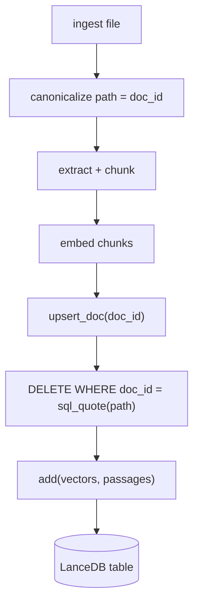
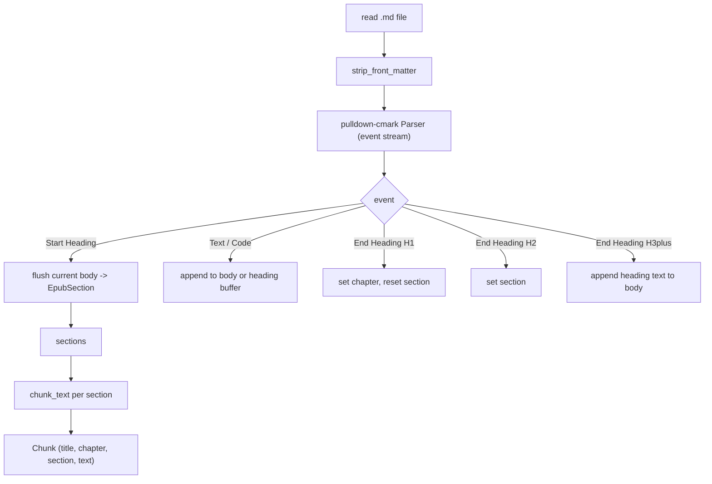
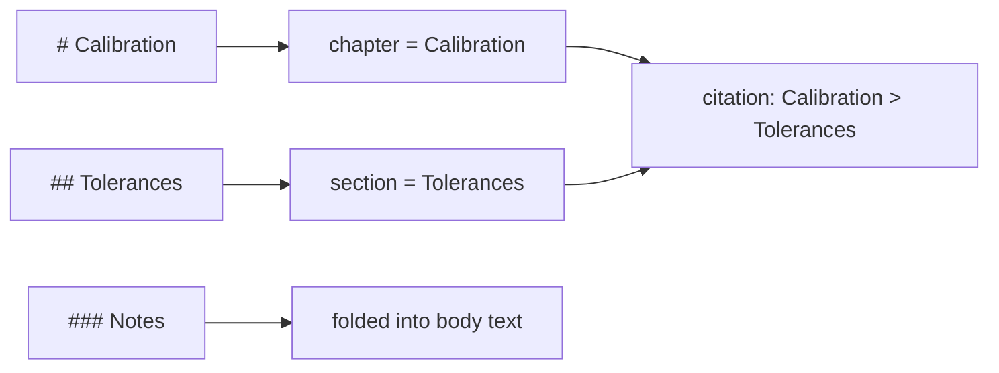
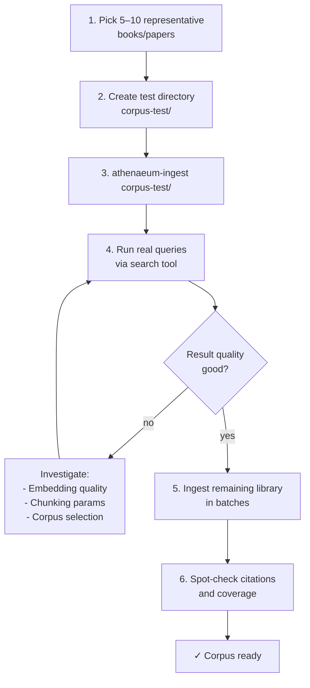

# Ingestion Guide — Loading Your Corpus

Detailed guidance for ingesting a considerable library of PDF and EPUB files into the personal knowledge engine.

---

## Overview: Two Entry Points

| Method | Use Case | Scale |
|--------|----------|-------|
| **CLI: `athenaeum-ingest`** | Bulk directory ingestion | 10–1000+ documents |
| **MCP tool: `ingest_file`** | Single file via agent | 1–5 documents per session |

**Recommendation:** Use the CLI for corpus-scale loading. Use the MCP tool for ad-hoc ingestion during agent sessions.

---

## Document dedup via upsert (since v0.2)

Ingestion is now dedup-aware. When you re-ingest a file, its prior chunks are
replaced rather than duplicated. This is a document-level upsert (delete-then-add)
keyed on `doc_id` — the canonicalized absolute file path.



The delete predicate is SQL-quoted (`'` → `''`) so paths containing apostrophes
(e.g. `O'Reilly - SICP.pdf`) are safe. The chunking logic (`chunking.rs`) is
unchanged — upsert replaces the storage layer only.

### Schema change (v0.2)

A `doc_id` column was added to the LanceDB schema (breaking change). If you
have an existing `./data/athenaeum` store from a prior version, delete it
before running the new binary:

```bash
rm -rf ./data/athenaeum
```

Then re-ingest your corpus. This is a one-time migration; subsequent ingests
will use the upsert path and re-ingestion of the same file will replace its
prior chunks rather than duplicate them.

---

## Supported Formats & Extraction Behavior

### PDF Files

**Supported:** Text-based PDFs (searchable text).

**Not supported:** Scanned PDFs or image-only PDFs (no OCR).

**Extraction:**
- Text extracted page-by-page using `pdfium-render`.
- Title derived from filename stem (e.g., `my-book.pdf` → title `my-book`).
- Location metadata: `page N` (1-indexed).

**Example:**
```
File: algorithms.pdf
Extracted: 
  - title: "algorithms"
  - page 1: "Introduction to algorithms..."
  - page 2: "Chapter 1: Foundations..."
  - ...
```

### EPUB Files

**Supported:** Standard EPUB 2/3 with HTML spine items.

**Extraction:**
- Spine items iterated in order.
- Chapters detected via `<h1>` HTML tags.
- Sections detected via `<h2>` HTML tags.
- HTML tags stripped; plain text extracted.
- Title from EPUB metadata, or filename stem if metadata missing.
- Location metadata: `chapter > section` (or just chapter/section if only one present).

**Example:**
```
File: book.epub
Extracted:
  - title: "The Art of Computer Programming"
  - chapter: "Chapter 1", section: "Basics": "In this chapter..."
  - chapter: "Chapter 1", section: "Advanced": "Moving to advanced topics..."
  - chapter: "Chapter 2", section: None: "Chapter 2 begins..."
  - ...
```

**Limitations:**
- Simple HTML tag matching (not a full HTML parser); malformed HTML may yield incomplete text.
- Chapters and sections detected only via `<h1>` and `<h2>` tags; other heading levels ignored.

### Markdown Files

**Supported:** `.md` and `.markdown` files (case-insensitive extension matching).

**Extraction:**
- Title derived from filename stem (e.g., `quality-manual.md` → title `quality-manual`), same convention as PDF/EPUB.
- Leading YAML front matter (`---` ... `---`) is stripped unconditionally — it is not parsed into fields.
- `#` headings become the **chapter**; `##` headings become the **section** (resets on each new `#`).
- `###` and deeper headings are folded into the surrounding body text (not used for citations), mirroring how EPUB ignores heading levels beyond `<h2>`.
- Inline formatting (bold, italic, links) and code spans are reduced to their visible plain text by the Markdown parser (pulldown-cmark) — no manual stripping needed.
- Fenced code blocks and tables are flattened to plain text; this may split awkwardly under sentence-boundary chunking (see Known Limitations).
- Location metadata: `chapter > section`, same format as EPUB.

**Example:**
```
File: quality-manual.md
Extracted:
  - title: "quality-manual"
  - chapter: "Calibration", section: "Tolerances": "All instruments must be calibrated..."
  - chapter: "Calibration", section: None: "General calibration procedures..."
  - ...
```





---

## Chunking Model

Text is split at **sentence boundaries** with configurable overlap:

| Parameter | Default | Description |
|-----------|---------|-------------|
| `min_tokens` | 500 | Target minimum tokens per chunk |
| `max_tokens` | 1000 | Target maximum tokens per chunk |
| `overlap_tokens` | 100 | Overlap between consecutive chunks |

**Token estimation:** `word_count × 1.3` (standard LLM approximation, rounded up).

**Algorithm:**
1. Split text into sentences (boundaries: `.`, `!`, `?` followed by space and uppercase letter).
2. Group sentences into chunks, targeting `min_tokens` to `max_tokens`.
3. When a chunk reaches `max_tokens`, start a new chunk.
4. Add overlap from the previous chunk to preserve context.

**Example:**
```
Text: "Sentence 1. Sentence 2. Sentence 3. Sentence 4. Sentence 5."
Tokens: [50, 60, 55, 70, 65] (hypothetical)

Chunk 1: "Sentence 1. Sentence 2. Sentence 3." (165 tokens)
Chunk 2: "Sentence 3. Sentence 4." (125 tokens, with overlap from Chunk 1)
Chunk 3: "Sentence 4. Sentence 5." (135 tokens, with overlap from Chunk 2)
```

**Reasoning about chunk counts:**
- A 100-page book with ~250 words per page = ~25,000 words.
- At 1.3 tokens/word = ~32,500 tokens.
- With 500–1000 token chunks = ~32–65 chunks per book.
- Adjust `min_tokens` and `max_tokens` in `crates/ingest/src/chunking.rs` if needed.

---

## Recommended Corpus Workflow

Follow the decision brief's validated build sequence:



**Why validate first?**
- Embedding quality on technical/code-heavy content is unproven with a general text model.
- Chunking parameters may need tuning for your corpus.
- Early validation prevents wasting time on a full ingest that yields poor results.

---

## CLI Reference: `athenaeum-ingest`

### Usage

```bash
athenaeum-ingest <DIRECTORY> [OPTIONS]

Options:
  -r, --recursive    Recursively ingest files in subdirectories
  -v, --verbose      Verbose output with detailed logging
  -h, --help         Print help information
```

### Examples

**Ingest a single directory:**
```bash
nix develop --command cargo run -p athenaeum-ingest -- /path/to/documents
```

**Recursively ingest subdirectories:**
```bash
nix develop --command cargo run -p athenaeum-ingest -- /path/to/documents --recursive
```

**Verbose output:**
```bash
nix develop --command cargo run -p athenaeum-ingest -- /path/to/documents --recursive --verbose
```

### Output Example

```
Found 5 file(s) to ingest in /path/to/documents
[1/5] Ingesting book1.pdf... ✓ (45 chunks)
[2/5] Ingesting book2.epub... ✓ (38 chunks)
[3/5] Ingesting paper.pdf... ✓ (12 chunks)
[4/5] Ingesting chapter.epub... ✓ (28 chunks)
[5/5] Ingesting invalid.txt... ✗ Error: unsupported file type: txt

============================================================
Ingestion Summary
============================================================
Total files processed: 5
Successful: 4
Failed: 1
Total documents: 4
Total chunks: 123
```

### File Discovery

- Recursively discovers `.pdf`, `.epub`, `.md`, and `.markdown` files (case-insensitive).
- Skips all other file types silently (or reports error if `--verbose`).
- Files are processed in sorted order for consistent runs.
- Progress is printed per-file with chunk count.

---

## Operating at Scale: Critical Gotchas

### ⚠️ Gotcha 1: Re-running Appends Duplicates

**The Problem:**
LanceDB's `add()` operation is a pure **append**. There is no deduplication or upsert. If you run the CLI twice on the same directory, you will have **duplicate rows** in the database.

**Example:**
```bash
# First run: 100 chunks ingested
athenaeum-ingest /path/to/documents

# Second run: 100 chunks appended again
athenaeum-ingest /path/to/documents

# Result: 200 rows in the database (100 duplicates)
```

**Impact:**
- Search results will include duplicates.
- Scores may be skewed (same passage appears twice).
- Storage bloat.

**Mitigation:**
- **Ingest each source once.** Keep a record of what you've ingested.
- **To re-ingest:** Delete `./data/athenaeum` and start clean.
- **Future enhancement:** An upsert mode or dedup tool (not yet implemented).

### ⚠️ Gotcha 2: Working Directory Coupling

**The Problem:**
The default `db_path` is **relative**: `./data/athenaeum`. This means the CLI and server are coupled to the working directory.

**Example:**
```bash
# Terminal 1: Server from repo root
cd /path/to/athenaeum-mcp
cargo run -p athenaeum-mcp-server
# Creates/uses: /path/to/athenaeum-mcp/data/athenaeum

# Terminal 2: CLI from a subdirectory
cd /path/to/athenaeum-mcp/crates/ingest
cargo run -p athenaeum-ingest -- /path/to/documents
# Creates/uses: /path/to/athenaeum-mcp/crates/ingest/data/athenaeum
# ❌ Different database!
```

**Mitigation:**
- **Always run both from the repo root.**
- If you need absolute paths, modify `Config::db_path` in `crates/core/src/config.rs` and rebuild.

### ⚠️ Gotcha 3: Per-Document Single Embed Call

**The Problem:**
`Engine::add_passages()` sends **all chunks of a document in one Ollama request**. Large documents mean large requests.

**Example:**
```
Book: 500 pages, 50 chunks
Ollama request: POST /api/embed with 50 text strings
Response: 50 × 768-dim vectors
```

**Impact:**
- Memory usage on the Ollama instance scales with document size.
- Latency per document is higher (but fewer round-trips).
- Very large PDFs (1000+ pages) may hit Ollama memory limits.

**Mitigation:**
- Ingest large documents in batches (split into multiple files).
- Monitor Ollama memory usage during ingestion.
- If Ollama crashes, reduce document size or increase Ollama's memory allocation.

### ⚠️ Gotcha 4: Sequential Processing, No Resume

**The Problem:**
Files are processed one at a time. If the CLI is interrupted (Ctrl+C, crash, network failure), there is **no checkpoint**. Already-ingested files will be re-appended on restart (ties back to Gotcha 1).

**Example:**
```bash
athenaeum-ingest /path/to/documents --recursive
# Processes: file1.pdf ✓, file2.pdf ✓, file3.pdf ✓, file4.pdf ✗ (error)
# Ctrl+C

# Restart:
athenaeum-ingest /path/to/documents --recursive
# Re-processes: file1.pdf ✓ (duplicate!), file2.pdf ✓ (duplicate!), ...
```

**Mitigation:**
- Ingest in smaller batches (e.g., 10–20 files per run).
- If interrupted, delete `./data/athenaeum` and restart.
- Future enhancement: Checkpoint/resume support (not yet implemented).

---

## Throughput & Sizing Guidance

### Typical Performance

- **Embedding rate:** ~100–500 chunks per minute (depends on Ollama hardware and text size).
- **Bottleneck:** Ollama embedding latency (network + model inference).

### Estimating Ingestion Time

```
Total chunks = (total words in corpus / 1.3) / avg_tokens_per_chunk
Time ≈ total_chunks / embedding_rate

Example:
- Corpus: 10 books × 100,000 words each = 1,000,000 words
- Chunks: 1,000,000 / 1.3 / 750 (avg) ≈ 1,026 chunks
- At 300 chunks/min: ~3.4 minutes
```

### Batching Strategy

For a large library (1000+ documents):

1. **Organize into subdirectories** by category or size:
   ```
   corpus/
     ├── cs-fundamentals/
     ├── fp-theory/
     ├── graphics/
   ```

2. **Ingest incrementally:**
   ```bash
   athenaeum-ingest corpus/cs-fundamentals
   athenaeum-ingest corpus/fp-theory
   athenaeum-ingest corpus/graphics
   ```

3. **Verify after each batch:**
   ```bash
   # Run a few test queries to confirm quality
   ```

4. **If quality is poor, delete and restart:**
   ```bash
   rm -rf ./data/athenaeum
   # Adjust chunking params or corpus selection
   ```

---

## Verifying Ingestion

### 1. Check Chunk Count

After ingestion, the summary shows total chunks:

```
Total chunks: 123
```

### 2. Query Known Content

Use the `search` tool to query for content you know is in the corpus:

```json
{
  "query": "machine learning",
  "k": 5
}
```

### 3. Verify Citations

Each result includes `source` and `location`:

```json
{
  "source": "algorithms.pdf",
  "location": "page 42",
  "text": "Machine learning is the study of...",
  "score": 0.87
}
```

Confirm that:
- `source` matches the document you ingested.
- `location` is reasonable (e.g., page number is within the document).
- `text` is the actual passage from the document.

### 4. Spot-Check Coverage

Query for different topics to ensure diverse coverage:

```bash
search("functional programming", k=5)
search("graphics rendering", k=5)
search("type systems", k=5)
```

If any query returns no results or low scores, investigate:
- Is the content actually in the corpus?
- Is the embedding model capturing the semantics?
- Do the chunks need different parameters?

---

## Known Limitations & Future Improvements

### Current Limitations

1. **PDF text extraction** — Works only with text-based PDFs (not scanned images). No OCR support.
2. **EPUB chapter detection** — Simple HTML tag matching (not a full HTML parser). Malformed HTML may yield incomplete text.
3. **Markdown code/table flattening** — Fenced code blocks and tables are reduced to plain text; sentence-boundary chunking may split them awkwardly (v1 limitation).
4. **Token estimation** — Approximate (1 word ≈ 1.3 tokens). Not a real tokenizer.
5. **Sentence splitting** — Simple heuristic (may not work for all languages or punctuation styles).
6. **No deduplication** — Re-ingesting creates duplicates.
7. **No resume** — Interrupted runs must be restarted from scratch.

### Potential Future Improvements

1. **OCR support** — Add image-based PDF support via OCR.
2. **Advanced HTML parsing** — Use a proper HTML parser for more robust EPUB extraction.
3. **Language-specific chunking** — Support for different languages and punctuation.
4. **Real tokenizer** — Use the actual `nomic-embed-text` tokenizer for precise counts.
5. **Progress persistence** — Resume interrupted ingestion jobs.
6. **Parallel processing** — Process multiple files concurrently.
7. **Metadata extraction** — Extract author, publication date, etc. from documents.
8. **Upsert mode** — Replace existing passages instead of appending.

---

## Troubleshooting

### CLI Hangs or Crashes

**Symptom:** `athenaeum-ingest` stops responding or crashes mid-run.

**Likely cause:** Ollama out of memory or network timeout.

**Fix:**
- Check Ollama logs: `ollama serve` (in another terminal).
- Increase Ollama memory allocation (see Ollama docs).
- Reduce document size or chunk size.
- Restart Ollama and retry.

### "Unsupported file type" for `.pdf` or `.epub`

**Symptom:** CLI reports `✗ Error: unsupported file type: pdf` for a valid PDF.

**Likely cause:** File extension is uppercase (`.PDF`) or has extra characters.

**Fix:**
- Rename to lowercase: `mv MyBook.PDF mybook.pdf`
- Check for hidden characters: `ls -la`

### Search Returns No Results After Ingestion

**Symptom:** CLI reports successful ingestion, but `search(query, k)` returns `[]`.

**Likely causes:**
1. CLI and server running from different directories (Gotcha 2).
2. Ollama not running or model not loaded.
3. Query is too specific or semantically distant from corpus.

**Fix:**
- Verify both run from repo root: `pwd`
- Verify Ollama: `curl http://localhost:11434/api/tags`
- Try a broader query: `search("book", k=5)`

### "Empty document" Error

**Symptom:** CLI reports `✗ Error: empty document` for a file.

**Likely cause:** PDF has no text (scanned image) or EPUB has no spine items.

**Fix:**
- For PDFs: Use OCR or convert to text-based PDF.
- For EPUBs: Verify the file is valid (try opening in an EPUB reader).

---

## Next Steps

- **[setup.md](setup.md)** — Verify your environment is ready.
- **[integration.md](integration.md)** — Wire the server into opencode agents.
- **[architecture.md](architecture.md)** — Understand the system design.
