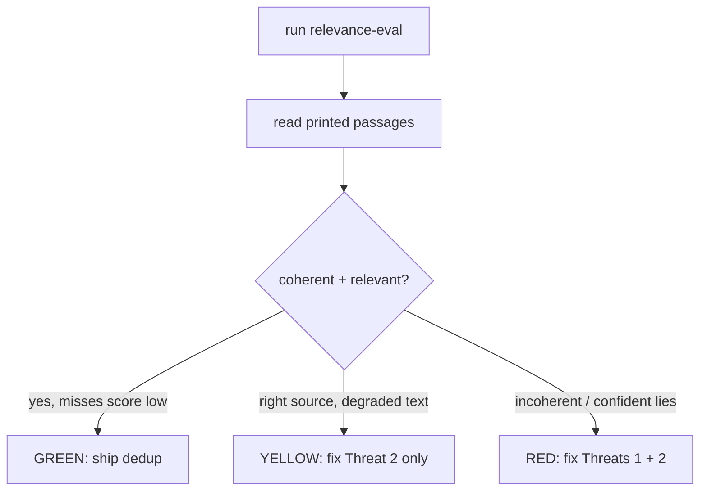

# Relevance eval — Fork B quality gate

This eval measures search quality on the **existing** chunker and storage code
to decide whether chunker hardening (Fork A) is needed before the colleague demo.

## Purpose

The colleague demo is sold on "search responses that matter for their problem."
Search quality is a function of chunk quality (the search path itself is frozen).
This eval surfaces whether the current chunker produces coherent, findable
passages — or whether it shreds technical prose / silently truncates content.

## Preconditions

- **Live Ollama** running with `nomic-embed-text` loaded.
- **Nix shell:** run all commands inside `nix develop`.
- **Repo root:** run from the repository root (the default store is `./data/athenaeum`).
- **Corpus:** a directory with `.pdf` and/or `.epub` files to ingest for the eval.

## How to run

```bash
nix develop --command cargo run -p athenaeum-ingest --bin relevance-eval -- \
    --corpus /path/to/your/corpus \
    --queries crates/ingest/eval/queries.toml
```

Optional flags:
- `--k <N>` — top-k results per query (default: 5).

## Writing queries

Queries live in `crates/ingest/eval/queries.toml`. Each entry has:

| Field    | Description |
|----------|-------------|
| `text`   | The search query string |
| `expect` | `"hit"` (should return relevant passage) or `"miss"` (should return nothing) |
| `note`   | Free-text note about what a relevant hit looks like |

**Critical rules:**
1. Write queries **before** re-reading the corpus. A 5–6 year gap since last
   reading is the only defense against "teaching to the test."
2. `expect="hit"` queries test the mechanism — does semantic search bridge
   the vocabulary gap between your reconstructed questions and the actual text?
3. `expect="miss"` queries test **discrimination** — does the system confidently
   lie on unanswerable questions? A high-score hit on a miss query is a demo-killer.

Include 2–3 miss queries for things you are certain are NOT in the corpus.

## Reading the output

For each query, the eval prints:
- Query text, expect tag, and note
- Top-k hits with score, source, location, and **full passage text**
- A grading checklist per query

You must **read the passage text**, score alone is insufficient — a high-scoring
hit from the right book may still be a mid-sentence fragment (Threat 1) or
truncated (Threat 2).

## Verdict definition



| Verdict | Criteria | Action |
|---------|----------|--------|
| **GREEN** | All hit queries return coherent, relevant passages; miss queries return low-score/no hits | Ship dedup as-is. Defer Fork A. |
| **YELLOW** | Right sources appear but passages degraded (false splits, truncated tails) | Fix Threat 2 only (token estimate safety margin). Threat 1 may be recoverable via overlap. |
| **RED** | Passages are incoherent (shredded citations, severe truncation) or miss queries return confident lies | Fix both Threats 1 and 2 before demo. |

## What this eval validates

This eval validates the **mechanism** on your shared-work-domain corpus, with
queries written by someone in the same domain as the colleague. The mechanism
(semantic search bridging a vocabulary gap) is shared — if it works here, the
remaining risk at demo time is corpus-specific: does the colleague's particular
text trigger chunker corners the eval corpus didn't?

## CI policy

This binary MUST NOT be added to CI or `cargo test`. It requires live Ollama
and a human grader. It is a hand-run diagnostic instrument.
